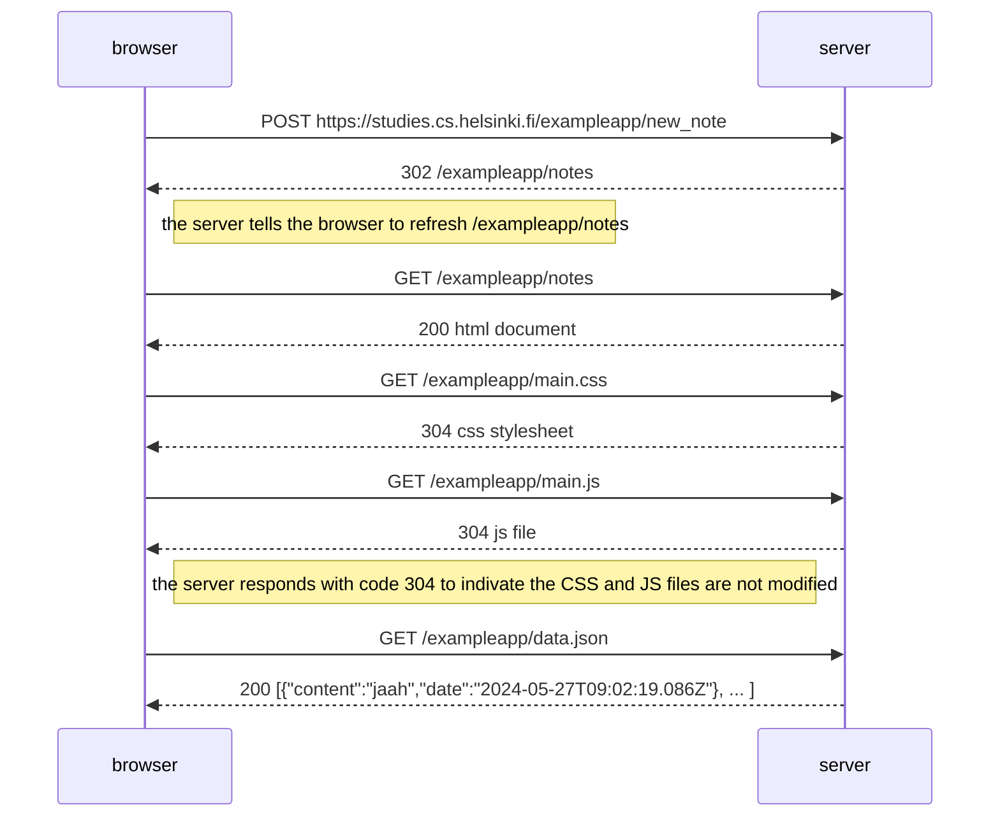

```mermaid
sequenceDiagram
    browser->>server: POST https://studies.cs.helsinki.fi/exampleapp/new_note
    server-->>browser: 302 /exampleapp/notes
    Note right of browser: the server tells the browser to refresh /exampleapp/notes
    browser->>server: GET /exampleapp/notes
    server-->>browser: 200 html document
    browser->>server: GET /exampleapp/main.css
    server-->>browser: 304 css stylesheet
    browser->>server: GET /exampleapp/main.js
    server-->>browser: 304 js file
    Note right of browser: the server responds with code 304 to indivate the CSS and JS files are not modified
    browser->>server: GET /exampleapp/data.json
    server-->>browser: 200 [{"content":"jaah","date":"2024-05-27T09:02:19.086Z"}, ... ]
```
