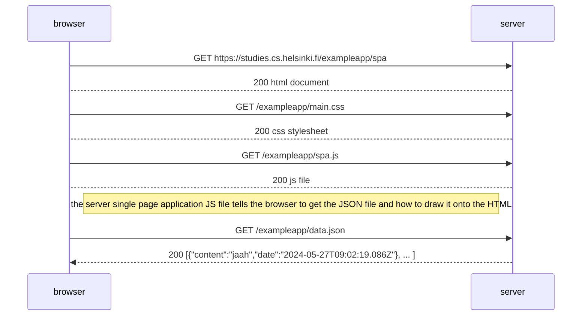

```mermaid
sequenceDiagram
    browser->>server: GET https://studies.cs.helsinki.fi/exampleapp/spa
    server-->browser: 200 html document
    browser->>server: GET /exampleapp/main.css
    server-->browser: 200 css stylesheet
    browser->>server: GET /exampleapp/spa.js
    server-->browser: 200 js file
    Note right of browser: the server single page application JS file tells the browser to get the JSON file and how to draw it onto the HTML
    browser->>server: GET /exampleapp/data.json
    server-->>browser: 200 [{"content":"jaah","date":"2024-05-27T09:02:19.086Z"}, ... ]
```
